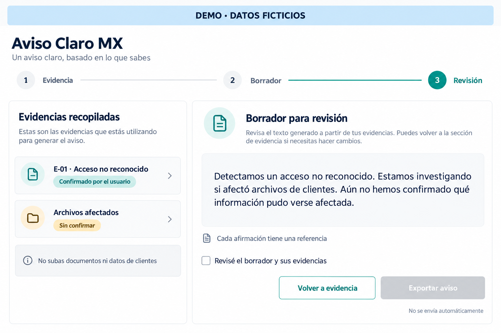
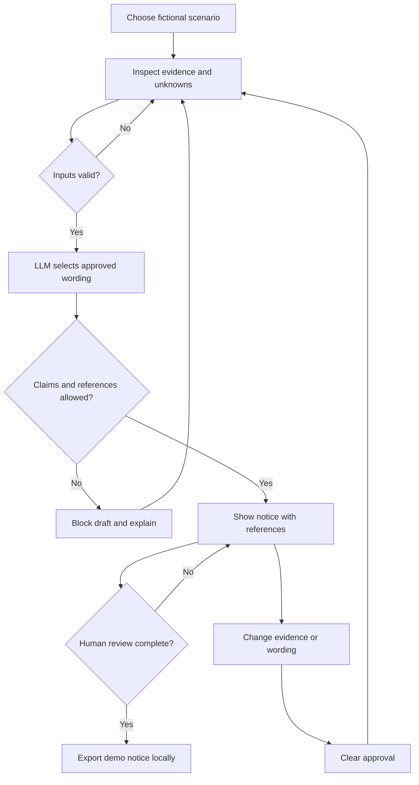
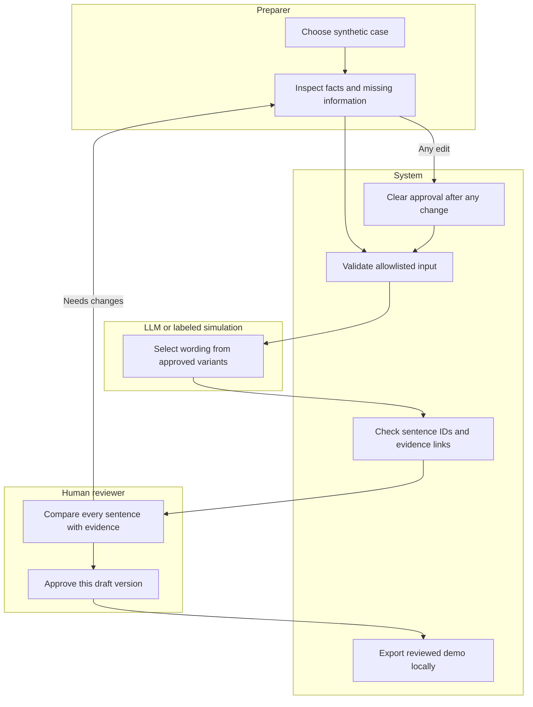

# PACKET - Valeria - Week 8

**Product:** Aviso Claro MX  
**Role:** Adversary  
**Status:** Packet before code - 29 September 2026. No app, user test, bug fix, commit, or deployment is claimed yet.  
**Declared slice:** Evidence-gated business-notice drafts, human approval, and attack tests.  
**Team fit:** The team's primary vacuum is breach-victim response. My slice supports the business side of that response; it is not a new team-wide vacuum.

## 1. The problem, in my words

When a small business detects unusual access, someone has to explain what happened. Writing too early can invent who was affected. Waiting for every detail can leave people without useful information. I want a tool that turns the facts a business has recorded into a short notice, keeps unknown details visible, and stops unsupported statements from reaching the final export.

My adversary question is: can this tool create another leak, invent a fact, or make a weak draft look officially approved? The design must answer all three. It does not investigate a breach or decide whether a person is safe.

## 2. Exact user and task

**Synthetic user:** Mariana Torres, 46, administrator of a small accounting office in Mexico. She uses email, Excel, and WhatsApp, reads slowly under pressure, and has no cybersecurity training. This is an invented design persona, informed by the team's evidence about confusing response journeys; she is not an interviewed person.

**Trigger:** Her IT provider reports an unrecognized login. She needs to prepare a first notice for the owner to review. She does not yet know whether client files were accessed.

**Task:** Choose a fictional scenario, inspect its evidence, prepare a short Spanish draft, review every sentence against its source, then export a clearly labeled demo notice. The owner or designated reviewer is a separate actor in the real workflow. For the classroom prototype, one tester switches between the preparer and reviewer steps; the checkbox is an acknowledgment, not authenticated proof of independent review.

## 3. Success before the module closes

A signed-out visitor can complete the fictional unrecognized-access case at a public URL on desktop and phone. The notice reports only the recorded access and investigation status, keeps file impact unknown, links each factual sentence to evidence, and cannot export before review. Changing evidence or draft options clears approval and blocks export until a new review.

Acceptance targets: zero unsupported factual claims in the tested exports; no requested IDs, passwords, client lists, or uploaded files; a working trusted-device warning; visible AI mode; five meaningful commits; two production deployments; one observed bug fixed and retested. These are targets, not results. Compare task time and errors against a static notice template; no time-saving claim is made until measured.

## 4. Image-generated mockup

Generated with the built-in image-generation tool on 29 September 2026. It is a concept, not a screenshot of a working product. The actual build must also show the current AI mode and the evidence reference beside each sentence; those details are not fully visible in the concept.

Three steps: **Evidencia -> Borrador -> Revision**. Keep the demo banner on every screen. In the final screen, the unreviewed export is disabled and the unknown status is amber, with a text label so meaning does not depend on color.

## 5. Flow - Mermaid

### Feature flowchart

### Swimlane - responsibilities

The diagrams define roles, not separate authenticated accounts. Failed validation never bypasses the gate. No route sends a message to clients.

## 6. Evidence model and drafting rule

Seed three JSON cases, all marked fictional: (A) unrecognized login with file impact unknown; (B) suspected access with no confirming source; (C) a fictional log showing one synthetic file was accessed, without proof of exfiltration. Include a fourth fixture for a reported impersonation/fundraiser case that routes to the team's victim support rather than inventing a business breach.

Each record has an internal ID, an allowlisted event type, source category, and status: **Confirmado por el usuario**, **Reportado, sin verificar**, or **Sin confirmar**. Confirmed means the operator says a source supports it. Neither the app nor the LLM independently authenticates that source. Do not upload the underlying log.

Input is limited to scenario IDs, evidence IDs, enums, and checkbox values. No free-text incident box, real company name, customer count, email address, URL, file upload, or personal identifier. Unknown remains the default. Record investigation-started as its own supported fact; the phrase 'estamos investigando' is not added automatically.

Use a small, human-written sentence catalog. Every variant has a sentence ID, allowed evidence requirements, certainty level, and exact Spanish wording. The LLM returns only sentence IDs and evidence IDs; the app constructs the text from its catalog. Zod validates the structure; a separate rule checker validates support. A valid JSON response is not evidence of factual truth.

For case A, only when both access and active investigation are recorded, an eligible draft is: 'Detectamos un acceso no reconocido. Estamos investigando si afecto archivos de clientes. Aun no hemos confirmado que informacion pudo verse afectada.' Each sentence shows its reference or unknown-state reason. A suspected event must use reported/suspected wording, never the confirmed variant.

Unknown references, unsupported variants, extra keys, reassurance such as 'tus datos estan seguros', and missing mandatory uncertainty statements block the draft. The reviewer checks the supporting source outside the app before real-world use. A structural pass is labeled 'Referencias completas', never 'incidente verificado'.

## 7. Scope cut

No breach search, stolen database, antivirus, password manager, automatic email, WhatsApp integration, forensic scanning, account recovery, legal certification, or real victim intake. No arbitrary AI-written incident prose or free-form edits in this version: the user changes facts and approved wording options. No stored cases, user accounts, database, payment collection, or production pilot. Export is a local TXT file and printable page, both watermarked **DEMO - DATOS FICTICIOS**.

The prototype helps prepare a notice; it does not determine legal duty, deadline, recipients, or whether the notice alone is sufficient. Mexican LFPDPPP Article 19 already provides for immediate notice where a breach significantly affects patrimonial or moral rights; the course's broad 'no notification duty' statement is not the product's premise.[3] A responsible reviewer must assess applicability. The app never recommends waiting a week.

## 8. Architecture and Dragon Stack

| Layer | Choice | Job / limit |
| --- | --- | --- |
| Web UI | Next.js + TypeScript | Three Spanish steps, responsive layout, accessible labels |
| LLM | Gemini API, eligible free-tier model configured through GEMINI_MODEL | Select approved sentence variants; server-side only; optional labeled simulation fallback |
| Security tooling | DOMPurify + Zod | Sanitize printable HTML; validate request and response structure |
| Security checks | Evidence rule checker + dependency audit | Block unsupported sentence/evidence combinations; review vulnerable packages |
| Third stack component | Structured fictional breach JSON + review state machine | Reproducible cases and approval invalidation |
| Export | Browser Blob TXT + sanitized print page | Local output after current-version review; no auto-send |
| Hosting | Vercel free plan for the classroom demo, subject to eligibility and limits | Public URL without visitor login; GitHub source |
| Storage | React memory only | No localStorage, cookies for cases, backend database, or saved drafts |
| Tests | Vitest + Playwright | Gate tests, attack cases, export and mobile flows |

The server accepts only allowlisted synthetic IDs and enums, derives its own catalog, and never trusts a client-supplied prompt. Keep the live API disabled by default until a free-tier key is configured. A request timeout, quota error, missing key, or rejected response switches to deterministic catalog selection with the label **IA SIMULADA - PLANTILLA DEMO**, including a short reason. The real path says **IA REAL - SOLO CASOS FICTICIOS**. A template fallback is not passed off as an LLM call.

Google's published free tier allows limited model access and says content may be used to improve products.[4] Therefore, send only fictional categorical inputs. Do not enable paid billing for the assignment. Require JSON POST, same-origin checks, a small request size, capped output, no retries on quota exhaustion, and no request-body logging. Hosting/provider operational metadata may exist; 'no stored case content' does not mean 'no network metadata'.

DOMPurify has a specific role at the printable HTML boundary; ordinary screen text uses React escaping. Sanitation does not establish incident truth. Avoid analytics and third-party embeds. Deploy security headers and a Content Security Policy tested against Next.js and print behavior; do not claim a perfect security score.

## 9. Blueprint conditions in my slice

| Condition | Concrete implementation |
| --- | --- |
| C1 - shadow | No identity fields, files, client lists, or auto-send; fictional seeds only |
| C2 - evidence and review | Catalog requirements, evidence labels, unknowns, current-version human review |
| C3 - usable Spanish | Short steps, readable type, print option, trusted-device warning before starting |
| C4 - accountable operation | No live-support promise; show 'academic demo, no case handling'; review role clearly identified |
| C5 - economics | Track drafting/review time and compare with static guide; pay-per-incident is an untested business hypothesis |
| C6 - test before pilot | Attack fixtures and two documented test passes; no real pilot in this build |

## 10. Security floor before code

1. **Secrets:** server environment variables only. No NEXT_PUBLIC API key, hardcoded key, committed .env file, or secret in screenshots. Use .env.example with empty placeholders; scan before each push.
2. **Auth:** this demo has no personal-data intake or persistent case storage. If later work introduces either, stop that scope change until Google sign-in and private data access are designed and implemented.
3. **RLS:** no Supabase table exists in this slice. If tables are added, enable RLS and prove with two users that cross-user reads fail before use.
4. **Validation:** client and server schemas, strict enums, lengths, request-size limits, malformed JSON handling, response validation, and allowlisted evidence checks. No raw form text enters a prompt.
5. **Demo data:** all cases, exports, screenshots, and persona details fictional and labeled. No real incident records in the repo or provider requests.

Memory-only state disappears on reload, but exported files remain on the user's device. Show 'Use a trusted device; delete demo exports on shared computers.' Human approval is a workflow control, not a signed authorization or an audit log.

## 11. Test plan - mechanical pass

| Test | Expected behavior |
| --- | --- |
| A: confirmed access, investigation active, impact unknown | Referenced preliminary draft; no claim clients were exposed |
| B: suspected access only | Suspected wording; confirmed template blocked |
| C: file access without evidence of theft | Access wording; no 'exfiltrated' claim |
| Fundraiser/impersonation case | Related victim-service route; no invented business breach |
| Invented evidence ID or unsupported sentence from mocked LLM | Draft blocked with a useful error |
| Script markup, extra fields, oversized or malformed API input | Rejected; no execution or prompt use |
| Export before review | Disabled in UI and blocked by export function |
| Approve, then change case/fact/wording or regenerate | Approval cleared; export blocked until re-reviewed |
| Direct export handler / stale version | Same gate applies; UI button alone is insufficient |
| API missing key, quota error, timeout, invalid JSON | Clearly labeled template fallback; never false 'AI real' label |
| Network and reload inspection | Only allowlisted payload; no case persistence or third-party telemetry |
| Mobile keyboard and print | Readable, usable labels; review checkbox keyboard accessible; printable text complete |

Run tests, record actual failures, fix at least one observed bug, and retest it on deployment 2. Do not deliberately plant a bug or invent a passing result. If nothing fails, broaden edge-case testing and record what was actually observed. Record commit hashes, URLs, dates, and screenshots in TEST_LOG.md. Use invented malicious test strings only.

## 12. Persona test - two passes

Open a fresh chat as synthetic Mariana. Show the three screens in order, asking her to attempt the task and narrate hesitation. Ask: what is confirmed, are client files known to be affected, who approves, does export send anything, and what happens after changing evidence?

Log each misunderstanding with the actual screenshot and response. Fix the worst one and re-show the changed screen to the same persona. A key risk is confusing 'Referencias completas' with independently verified facts; another is thinking the review checkbox sends the notice. Export PERSONA_Valeria.pdf only after testing. It is simulated feedback, not a real customer interview.

## 13. Global benchmark and translation

**Benchmark line:** The strongest existing benchmark I found for this workflow is OneTrust Privacy Operations, which manages incident-response workflows and jurisdiction-based notification guidance.[1]

**Localization line:** My slice differs by offering a narrow Spanish drafting/review journey for a Mexican small-business administrator, with fictional structured inputs and no central repository of victim identities.

Import the evidence -> draft -> review pattern. Do not claim OneTrust is unavailable in Mexico or that no competitor exists. Enterprise breadth is not proof of willingness to pay for this smaller tool. UK ICO breach-assessment guidance is a second reference for structured risk questions, but UK deadlines and legal thresholds cannot be imported as Mexican rules.[2] Our own catalog and legal wording require review before any real use.

## 14. Three-year view - three sentences

If this slice works, the full product becomes a Spanish incident-response workspace that helps small businesses organize evidence, communicate clearly, and track follow-up. It adds authenticated preparer/reviewer roles and private audit records only after privacy, access controls, and retention are ready. It connects to verified local response partners while keeping consequential decisions with accountable people and refusing to turn leaked identities into a product database.

## 15. Build order, delivery, and session close

Commit 1: packet, mockup, build prompt, decisions, and sources before app code. Commit 2: typed fictional cases and evidence rules. Commit 3: three-step UI, review state, local export, and security tooling. Commit 4: LLM adapter and labeled fallback, tests, then deployment 1. Commit 5 or later: fix an actually observed mechanical/persona issue, add regression coverage, then deployment 2. Keep changes meaningful; do not rewrite history to manufacture packet-before-code evidence.

At each session close: update DECISIONS.md with decisions and actual results, write the next session's first move, commit, and push once a remote exists. Retain the real development transcript from the start. Final delivery: public URL tested signed out, GitHub link, 3-minute walkthrough plus 30-second reflection, PACKET_Valeria.pdf, PERSONA_Valeria.pdf, and full BUILDCHAT_Valeria.pdf. A transcript summary is not a raw export.

## Sources checked on 29 September 2026

[1] OneTrust, Privacy Operations: https://www.onetrust.com/products/privacy-operations/

[2] ICO, personal-data breach assessment: https://ico.org.uk/for-organisations/report-a-breach/personal-data-breach-assessment/

[3] Mexican LFPDPPP, current text published 20 March 2025, Article 19: https://www.ordenjuridico.gob.mx/Documentos/Federal/html/wo125102.html

[4] Gemini API pricing and free-tier data use: https://ai.google.dev/gemini-api/docs/pricing

[5] Gemini structured outputs: https://ai.google.dev/gemini-api/docs/structured-output

[6] DOMPurify official repository: https://github.com/cure53/DOMPurify

Team source: BLUEPRINT_Team_Week8_FINAL.pdf, Valeria declaration and conditions C1-C6. This packet makes no prediction of legal sufficiency, independent evidence verification, or proven customer demand.
